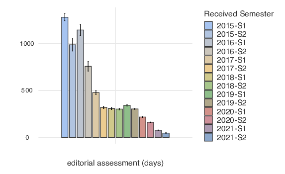
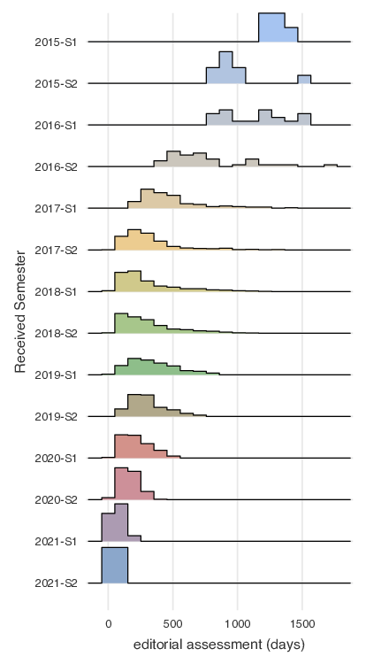
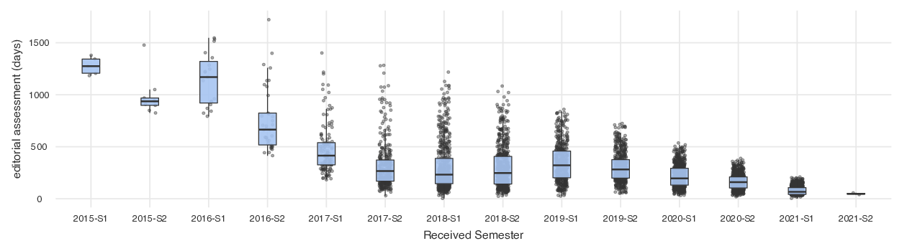

# Analysis of journals' timelines for editorial assessment

The `1-code/editorialAssessment.py` script retrieves metadata from Crossref about a journal's output.

### Use Case: the *Arabian Journal of Geosciences*

▷ August 23, 2021: Eracon Lachesis and Alexander Magazinov [reported on PubPeer](https://pubpeer.com/publications/C8E52D2C1D14211051FA23D6172599) issues with a publication from *Arabian Journal of Geosciences*. See this [annotated exemple](https://twitter.com/gcabanac/status/1430274452667965449):

▷ September 6, 2021: we ran `1-code/editorialAssessment.py` to retrieve the metadata of articles published since 2018 in the [*Arabian Journal of Geosciences*](https://www.springer.com/journal/12517) (a Springer journal). See the `2-results` folder produced with [Jamovi](https://www.jamovi.org).

The 3 plots show the duration of editorial assessment (days elapsed between reception and acceptance of manuscripts) through time, grouped by semester starting in 2018.

We observed an impressive and questionable shrinking of the duration of editorial assessments:
- 282 days in 2019-S2
- 159 days in 2020-S2
- 47 days in 2021-S2

▷ September 28, 2021: Springer published [Expressions of concern for 436 publications](https://retractionwatch.com/2021/09/28/springer-nature-slaps-more-than-400-papers-with-expressions-of-concern-all-at-once/) in the *Arabian Journal of Geosciences*.

### Background
See these Retraction Watch posts:

- https://retractionwatch.com/2021/08/26/guest-editor-says-journal-will-retract-dozens-of-inappropriate-papers-after-his-email-was-hacked/
- https://retractionwatch.com/2021/09/28/springer-nature-slaps-more-than-400-papers-with-expressions-of-concern-all-at-once/
- https://retractionwatch.com/2021/07/12/elsevier-says-integrity-and-rigor-of-peer-review-for-400-papers-fell-beneath-the-high-standards-expected/

See also this preprint reporting issues in the editorial assessment of [*Microprocessors and Microsystems*](https://www.journals.elsevier.com/microprocessors-and-microsystems) (an Elsevier journal):

> Cabanac, G., Labbé, C., Magazinov, A. (2021). Tortured phrases: A dubious writing style emerging in science. Evidence of critical issues affecting established journals. arXiv preprint (non peer-reviewed). https://arxiv.org/abs/2107.06751